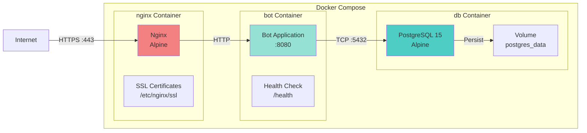
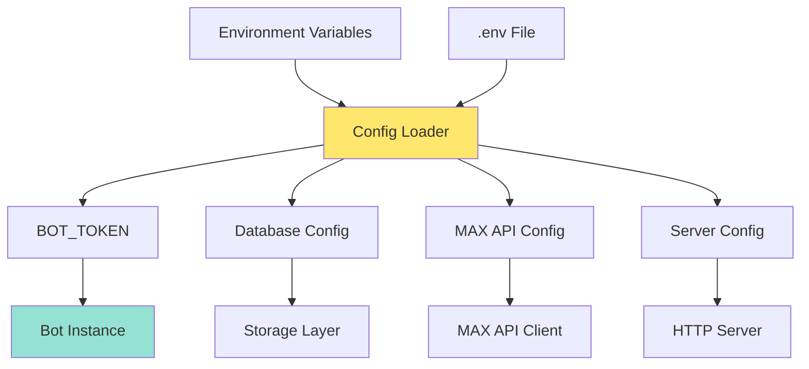
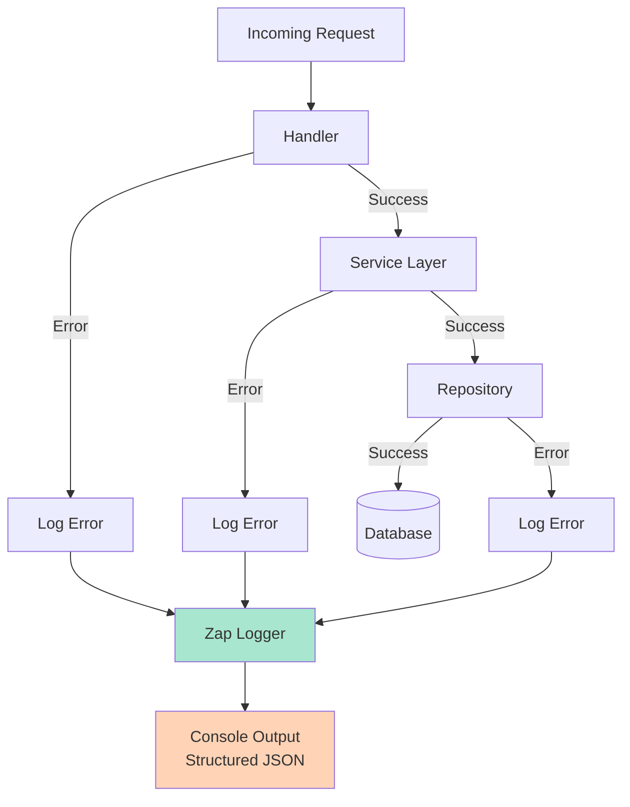

# Meeting Bot Architecture

## System Architecture Overview

```mermaid
graph TB
    subgraph "External Services"
        MAX[MAX Messenger API<br/>botapi.max.ru]
        Users[Users in MAX Messenger]
    end

    subgraph "Infrastructure"
        Nginx[Nginx Reverse Proxy<br/>:80, :443]
        Docker[Docker Network<br/>meeting-bot-network]
    end

    subgraph "Bot Application :8080"
        Main[main.go<br/>Entry Point]

        subgraph "Handlers Layer"
            MsgHandler[Message Handler<br/>Commands]
            CallbackHandler[Callback Handler<br/>Button Clicks]
        end

        subgraph "Services Layer"
            MeetingService[Meeting Service<br/>Business Logic]
            UserService[User Service<br/>User Management]
        end

        subgraph "Repository Layer"
            MeetingRepo[Meeting Repository<br/>Interface]
            VoteRepo[Vote Repository<br/>Interface]
            UserRepo[User Repository<br/>Interface]
        end

        subgraph "Storage"
            Storage[PostgreSQL Client<br/>Connection Pool]
        end
    end

    subgraph "Database"
        DB[(PostgreSQL 15<br/>:5432)]
    end

    Users -->|Messages/Buttons| MAX
    MAX -->|Webhook/Updates| Nginx
    Nginx -->|Proxy| Main

    Main --> MsgHandler
    Main --> CallbackHandler

    MsgHandler --> MeetingService
    MsgHandler --> UserService
    CallbackHandler --> MeetingService

    MeetingService --> MeetingRepo
    MeetingService --> VoteRepo
    UserService --> UserRepo

    MeetingRepo --> Storage
    VoteRepo --> Storage
    UserRepo --> Storage

    Storage -->|SQL Queries| DB

    Main -->|API Calls| MAX
    MeetingService -->|Send Messages| MAX

    style MAX fill:#ff6b6b
    style DB fill:#4ecdc4
    style Main fill:#95e1d3
    style Nginx fill:#f38181
```

## Layer Responsibilities

### 1. Handlers Layer
- **Message Handler**: Processes text commands (`/start`, `/create_meeting`, `/help`)
- **Callback Handler**: Processes button clicks (voting, results)
- **Responsibilities**: Parse inputs, validate, route to services

### 2. Services Layer
- **Meeting Service**: Meeting creation, voting logic, results calculation
- **User Service**: User registration and profile management
- **Responsibilities**: Business logic, orchestration, validation

### 3. Repository Layer
- **Interfaces**: Define data access contracts
- **Current Implementation**: Stub (in-memory) for development
- **Future**: PostgreSQL implementation
- **Responsibilities**: Data persistence, queries

### 4. Storage Layer
- **PostgreSQL Connection Pool**
- **Configuration**: Max 25 connections, 5 idle
- **Responsibilities**: Database connection management

## Technology Stack

| Component | Technology | Purpose |
|-----------|-----------|---------|
| Language | Go 1.24.4 | Bot implementation |
| Database | PostgreSQL 15 | Data persistence |
| HTTP Server | net/http | Webhook endpoint |
| API Client | Custom MAX SDK | Messenger integration |
| Logger | Uber Zap | Structured logging |
| Migration | Goose | Database migrations |
| Container | Docker | Deployment |
| Reverse Proxy | Nginx | SSL termination, routing |

## Deployment Architecture



## Configuration Management



## Error Handling & Logging


