# Component Connections & Data Flow

## Bot Component Dependencies


## Data Flow: Message Processing


## Repository Implementation Strategy


## MAX API Client Integration


## Configuration Sources

```mermaid
graph TD
    ENV[Environment Variables] --> Loader[Config Loader]
    DOTENV[.env File] --> Loader
    DEFAULTS[Default Values] --> Loader

    Loader --> BotConfig{Bot Config}

    BotConfig --> Token[BOT_TOKEN<br/>Required]
    BotConfig --> APIBase[MAX_API_BASE_URL<br/>Default: api.max.ru]
    BotConfig --> Port[SERVER_PORT<br/>Default: 8080]
    BotConfig --> VoteDuration[VOTING_DURATION<br/>Default: 120 min]
    BotConfig --> Debug[DEBUG<br/>Default: false]
    BotConfig --> LogLevel[LOG_LEVEL<br/>Default: info]

    BotConfig --> DBConfig{Database Config}

    DBConfig --> DBHost[DB_HOST<br/>Default: localhost]
    DBConfig --> DBPort[DB_PORT<br/>Default: 5432]
    DBConfig --> DBUser[DB_USER<br/>Default: postgres]
    DBConfig --> DBPass[DB_PASSWORD<br/>Default: postgres]
    DBConfig --> DBName[DB_NAME<br/>Default: meetingbot]
    DBConfig --> DBURL[DATABASE_URL<br/>Full connection string]

    Token --> App[Application]
    APIBase --> App
    Port --> App
    DBURL --> App

    style Token fill:#ff8b94
    style DBURL fill:#4ecdc4
    style App fill:#95e1d3
```



## Network Topology


## Port Mappings

| Service | Internal Port | External Port | Protocol | Purpose |
|---------|---------------|---------------|----------|---------|
| Nginx | 80 | 80 | HTTP | HTTP traffic (redirects to HTTPS) |
| Nginx | 443 | 443 | HTTPS | Secure webhook endpoint |
| Bot | 8080 | 8080 | HTTP | Health check, direct access |
| PostgreSQL | 5432 | 5432 | TCP | Database access (dev only) |

## Container Dependencies


## Logging Flow


## Error Propagation

```mermaid
graph BT
    DB[(Database)] -->|SQL Error| Repo[Repository]
    Repo -->|ErrNotFound<br/>ErrDuplicate<br/>ErrDatabase| Service[Service]
    Service -->|ErrUnauthorized<br/>ErrInvalidInput<br/>ErrNotFound| Handler[Handler]
    Handler -->|User Message<br/>"Meeting not found"| User[User]

    Repo -.->|Log Error| Logger[Logger]
    Service -.->|Log Error| Logger
    Handler -.->|Log Error| Logger

    style DB fill:#4ecdc4
    style Logger fill:#a8e6cf
    style User fill:#ff6b6b
```

## Concurrency Model


## Security & Authentication


