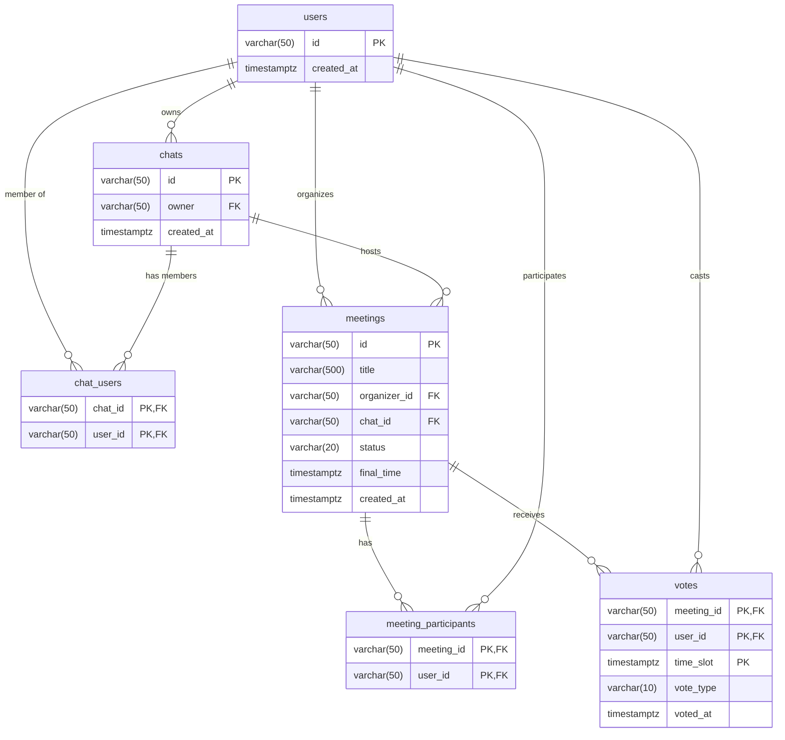
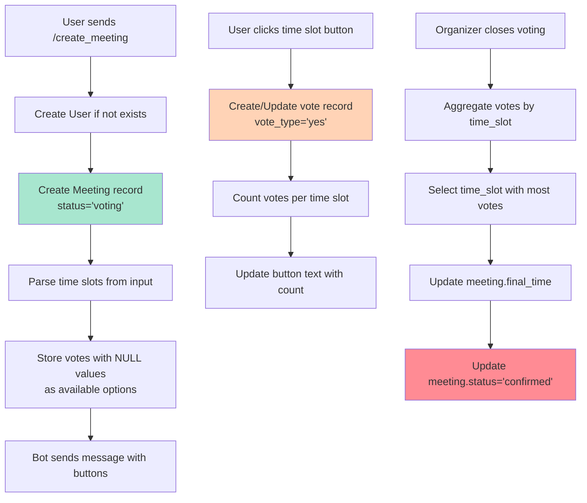

# Database Schema

## Entity Relationship Diagram



## Table Details

### users
**Purpose**: Store user profiles from MAX messenger

| Column | Type | Constraints | Description |
|--------|------|-------------|-------------|
| id | VARCHAR(50) | PRIMARY KEY | MAX messenger user ID |
| created_at | TIMESTAMPTZ | DEFAULT NOW() | User registration time |

**Relationships**:
- One user can own multiple chats
- One user can be member of multiple chats
- One user can organize multiple meetings
- One user can participate in multiple meetings
- One user can cast multiple votes

---

### chats
**Purpose**: Store chat groups where bot is present

| Column | Type | Constraints | Description |
|--------|------|-------------|-------------|
| id | VARCHAR(50) | PRIMARY KEY | MAX messenger chat ID |
| owner | VARCHAR(50) | FK → users(id) | Chat creator/admin |
| created_at | TIMESTAMPTZ | DEFAULT NOW() | Chat creation time |

**Relationships**:
- One chat has one owner (user)
- One chat can have multiple members
- One chat can host multiple meetings

---

### chat_users
**Purpose**: Junction table for chat membership

| Column | Type | Constraints | Description |
|--------|------|-------------|-------------|
| chat_id | VARCHAR(50) | PK, FK → chats(id) | Reference to chat |
| user_id | VARCHAR(50) | PK, FK → users(id) | Reference to user |

**Cascade**: Deletes when chat or user is deleted

---

### meetings
**Purpose**: Store meeting details

| Column | Type | Constraints | Description |
|--------|------|-------------|-------------|
| id | VARCHAR(50) | PRIMARY KEY | Unique meeting ID |
| title | VARCHAR(500) | | Meeting title/subject |
| organizer_id | VARCHAR(50) | FK → users(id) | Who created meeting |
| chat_id | VARCHAR(50) | FK → chats(id) | Where meeting organized |
| status | VARCHAR(20) | DEFAULT 'voting' | Meeting status |
| final_time | TIMESTAMPTZ | NULLABLE | Chosen meeting time |
| created_at | TIMESTAMPTZ | DEFAULT NOW() | Meeting creation time |

**Status Values**:
- `voting` - Voting in progress
- `confirmed` - Time selected, meeting confirmed
- `cancelled` - Meeting cancelled

**Relationships**:
- One meeting has one organizer
- One meeting belongs to one chat
- One meeting can have multiple participants
- One meeting can receive multiple votes

---

### meeting_participants
**Purpose**: Track who is invited/attending meetings

| Column | Type | Constraints | Description |
|--------|------|-------------|-------------|
| meeting_id | VARCHAR(50) | PK, FK → meetings(id) | Reference to meeting |
| user_id | VARCHAR(50) | PK, FK → users(id) | Reference to user |

**Cascade**: Deletes when meeting or user is deleted

---

### votes
**Purpose**: Store user votes for time slots

| Column | Type | Constraints | Description |
|--------|------|-------------|-------------|
| meeting_id | VARCHAR(50) | PK, FK → meetings(id) | Which meeting |
| user_id | VARCHAR(50) | PK, FK → users(id) | Who voted |
| time_slot | TIMESTAMPTZ | PK | Proposed time |
| vote_type | VARCHAR(10) | | 'yes' or 'no' |
| voted_at | TIMESTAMPTZ | DEFAULT NOW() | When vote cast |

**Primary Key**: (meeting_id, user_id, time_slot) - One vote per user per time slot per meeting

**Cascade**: Deletes when meeting or user is deleted

**Vote Types**:
- `yes` - User available at this time
- `no` - User not available (currently unused)

## Data Flow



## Indexes (Recommended)

```sql
CREATE INDEX idx_meetings_chat_id ON meetings(chat_id);
CREATE INDEX idx_meetings_organizer_id ON meetings(organizer_id);
CREATE INDEX idx_meetings_status ON meetings(status);
CREATE INDEX idx_votes_meeting_id ON votes(meeting_id);
CREATE INDEX idx_votes_time_slot ON votes(meeting_id, time_slot);
CREATE INDEX idx_meeting_participants_meeting_id ON meeting_participants(meeting_id);
CREATE INDEX idx_chat_users_user_id ON chat_users(user_id);
```

## Sample Queries

### Get all meetings in a chat with vote counts

```sql
SELECT
    m.id,
    m.title,
    m.status,
    u.id as organizer_name,
    COUNT(DISTINCT v.user_id) as total_votes
FROM meetings m
LEFT JOIN users u ON m.organizer_id = u.id
LEFT JOIN votes v ON m.id = v.meeting_id
WHERE m.chat_id = 'chat123'
GROUP BY m.id, m.title, m.status, u.id
ORDER BY m.created_at DESC;
```

### Get voting results for a meeting

```sql
SELECT
    v.time_slot,
    COUNT(v.user_id) as vote_count,
    ARRAY_AGG(u.id) as voters
FROM votes v
JOIN users u ON v.user_id = u.id
WHERE v.meeting_id = 'meeting123'
  AND v.vote_type = 'yes'
GROUP BY v.time_slot
ORDER BY vote_count DESC, v.time_slot ASC;
```

### Get user's upcoming meetings

```sql
SELECT
    m.id,
    m.title,
    m.final_time,
    m.status,
    c.id as chat_name
FROM meetings m
JOIN meeting_participants mp ON m.id = mp.meeting_id
JOIN chats c ON m.chat_id = c.id
WHERE mp.user_id = 'user123'
  AND m.status = 'confirmed'
  AND m.final_time > NOW()
ORDER BY m.final_time ASC;
```

## Migration Files

Location: `/migrations/20250109000001_create_initial_schema.sql`

**Up Migration**:
- Creates all tables in dependency order
- Adds foreign key constraints with CASCADE
- Sets default values

**Down Migration**:
- Drops all tables in reverse dependency order
- Handles `IF EXISTS` to prevent errors
