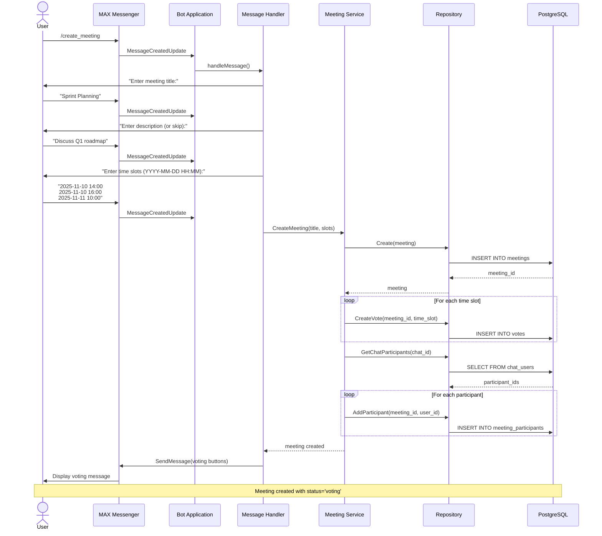
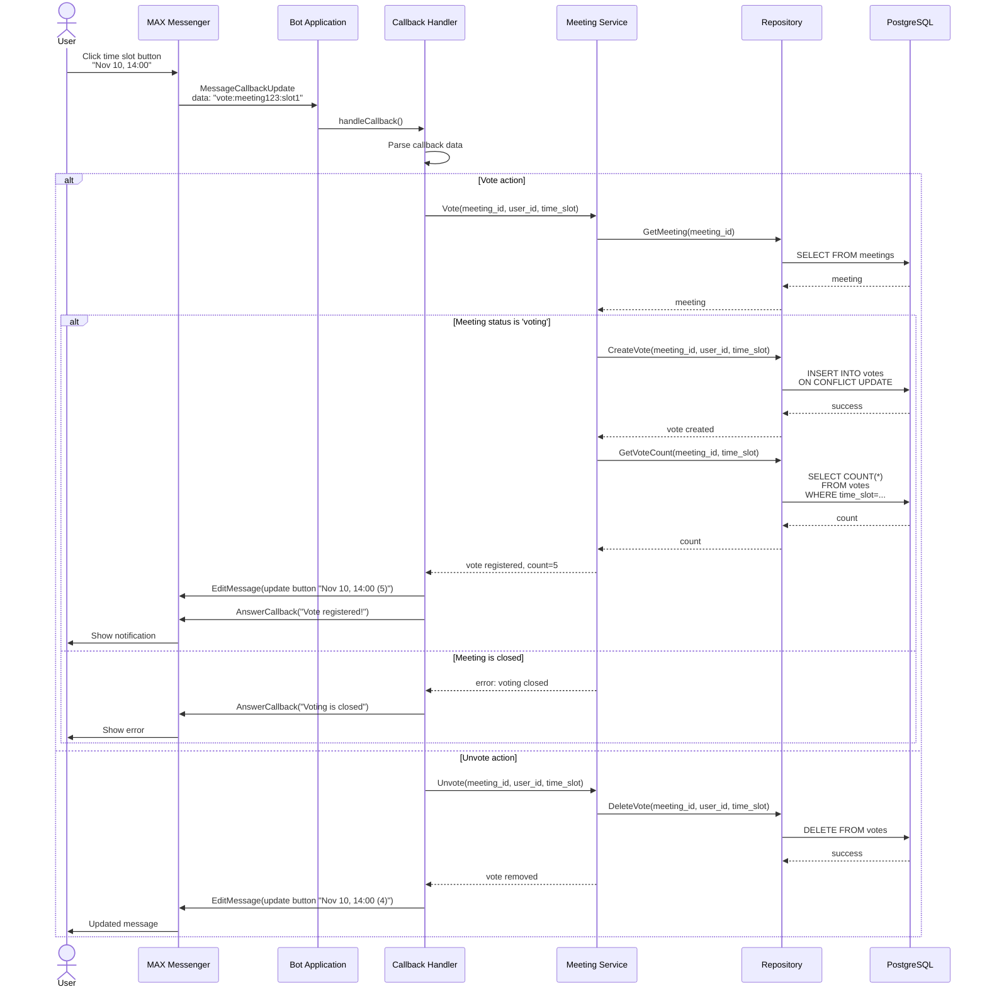
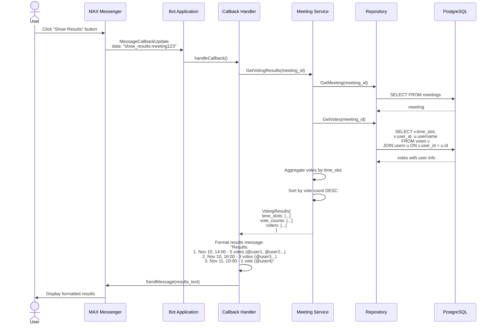
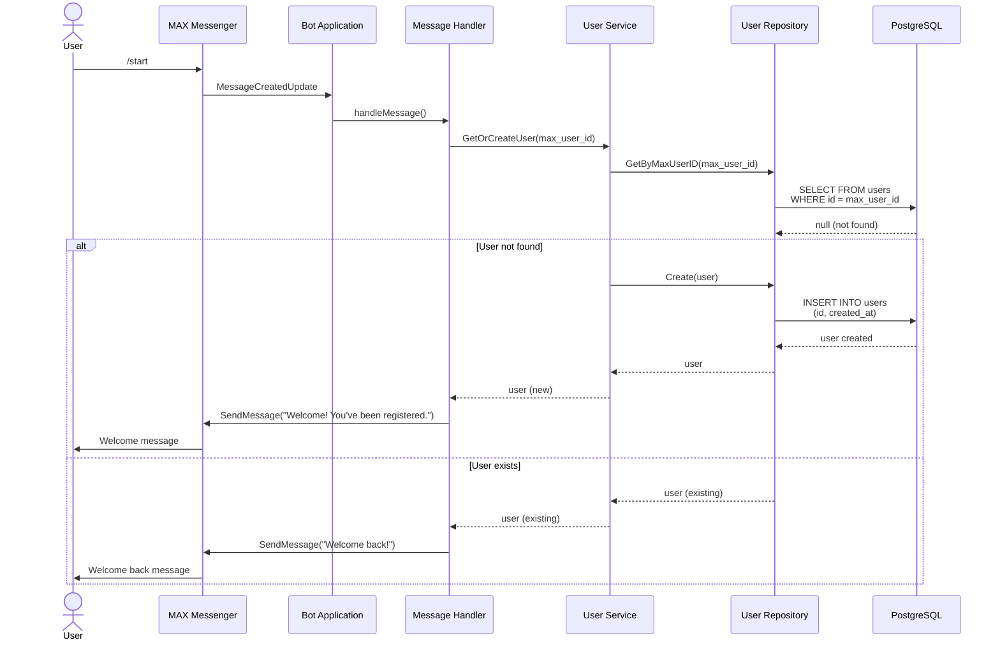
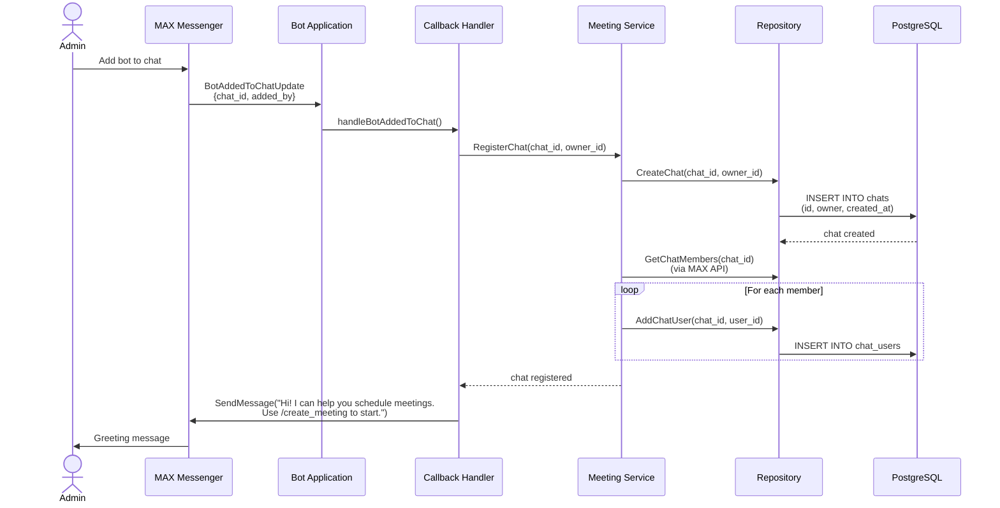
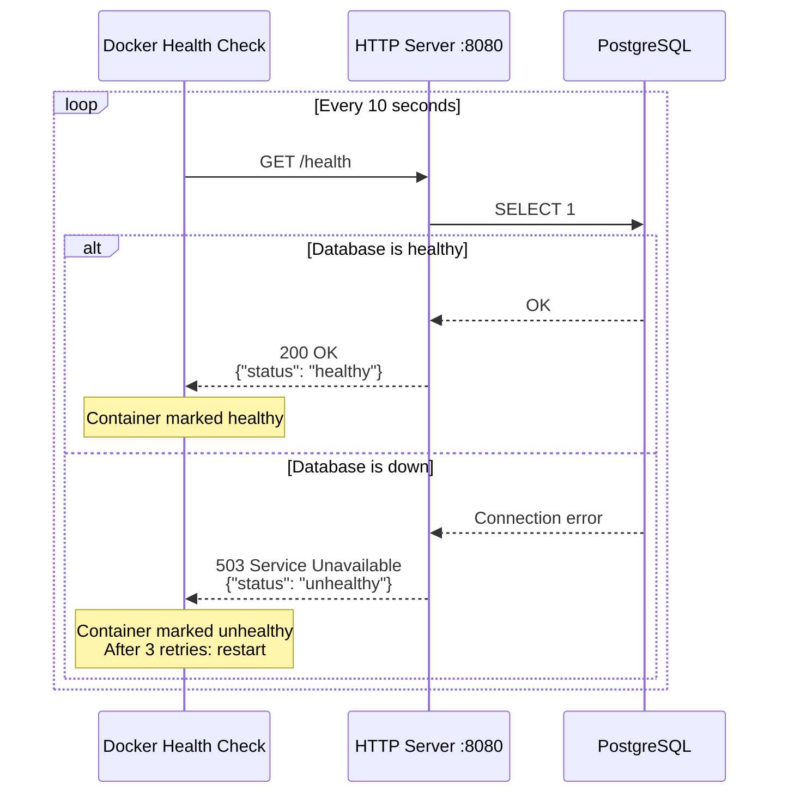
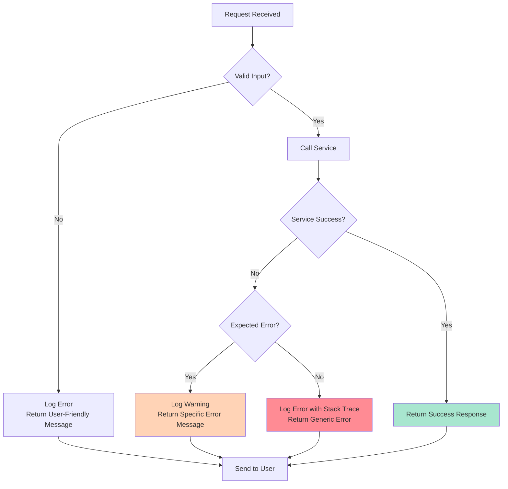
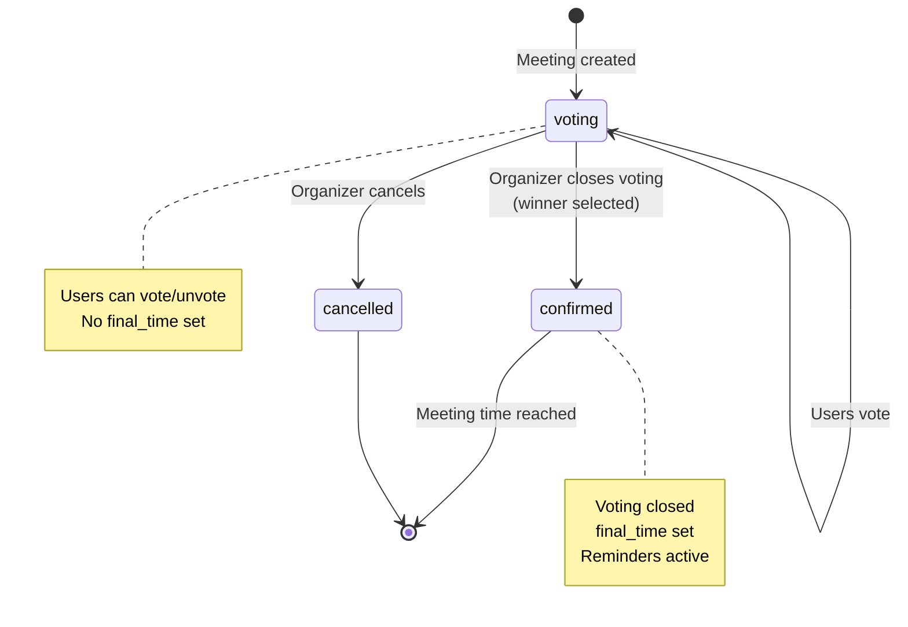

# Bot Workflows

## 1. Meeting Creation Workflow



## 2. Voting Workflow



## 3. Close Voting & Results Workflow

```mermaid
sequenceDiagram
    actor Organizer
    actor Participant
    participant MAX as MAX Messenger
    participant Bot as Bot Application
    participant CH as Callback Handler
    participant MS as Meeting Service
    participant Repo as Repository
    participant DB as PostgreSQL

    Organizer->>MAX: Click "Close Voting" button
    MAX->>Bot: MessageCallbackUpdate<br/>data: "close_voting:meeting123"

    Bot->>CH: handleCallback()
    CH->>MS: CloseVoting(meeting_id, organizer_id)

    MS->>Repo: GetMeeting(meeting_id)
    Repo->>DB: SELECT FROM meetings
    DB-->>Repo: meeting

    alt User is organizer
        MS->>Repo: GetVotingResults(meeting_id)
        Repo->>DB: SELECT time_slot,<br/>COUNT(*) as votes<br/>FROM votes<br/>GROUP BY time_slot
        DB-->>Repo: results
        Repo-->>MS: results with vote counts

        MS->>MS: Determine winning time_slot<br/>(max votes)

        MS->>Repo: UpdateMeeting(status='confirmed', final_time=winner)
        Repo->>DB: UPDATE meetings<br/>SET status='confirmed',<br/>final_time=...
        DB-->>Repo: success

        MS-->>CH: voting closed, winner selected
        CH->>MAX: EditMessage(remove buttons)
        CH->>MAX: SendMessage("Voting closed!<br/>Winning time: Nov 10, 14:00<br/>Votes: 5")
        MAX->>Organizer: Show result
        MAX->>Participant: Show result

    else User is not organizer
        MS-->>CH: error: unauthorized
        CH->>MAX: AnswerCallback("Only organizer can close voting")
        MAX->>Organizer: Show error
    end

    Note over Organizer,DB: Meeting status='confirmed'<br/>final_time set
```

## 4. Show Results Workflow



## 5. User Registration Workflow



## 6. Bot Added to Chat Workflow



## 7. Health Check Workflow



## Error Handling Flow



## State Machine: Meeting Status


